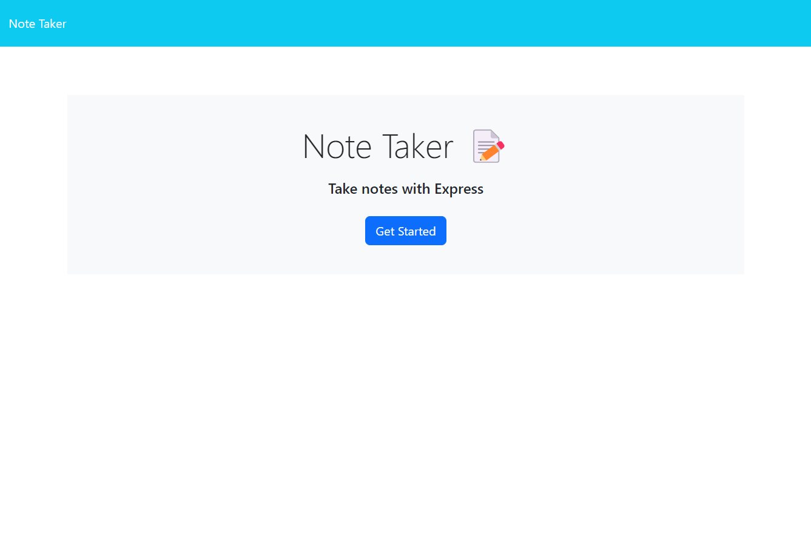
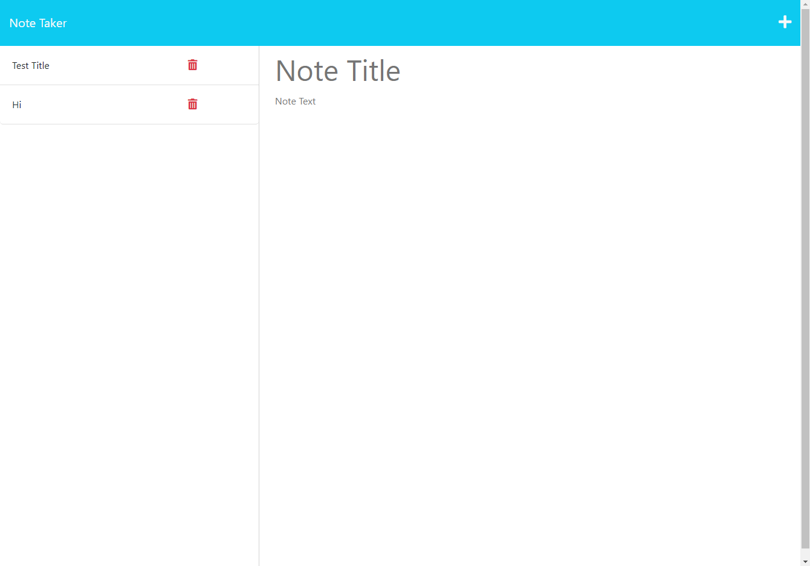

# .Js-Notes
Week 11 Challenge, Create a note taking app using back end 

## Description
using express js, created a note taking app. 
you are able to add new notes and see the notes that were already created and saved.

## Installation

To run the application you simply open the link provided that will direct you to the app. (link here)

## Usage

## Credits
https://medium.com/@nnamani.ezinne/simple-note-taking-app-using-node-js-and-ejs-4899321a3342
https://stackoverflow.com/questions/8864626/using-routes-in-express-js
https://stackoverflow.com/questions/45336632/what-is-middleware-in-express-js
https://stackoverflow.com/questions/10027963/express-js-install
## License

MIT License